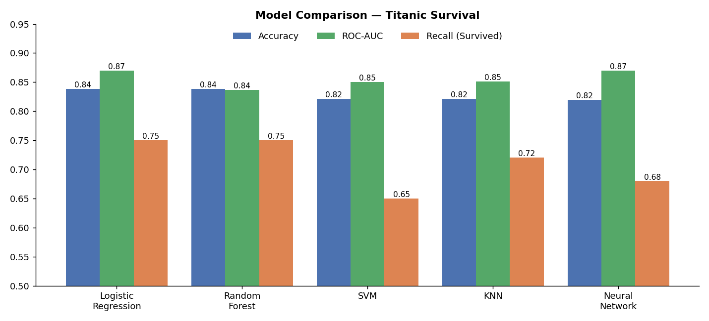
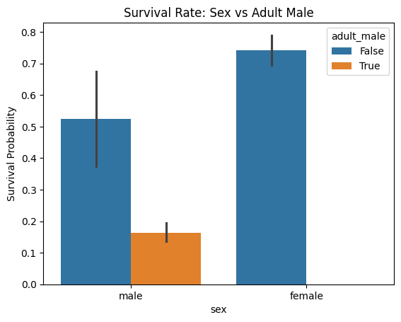
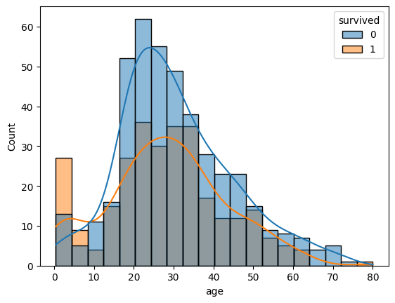
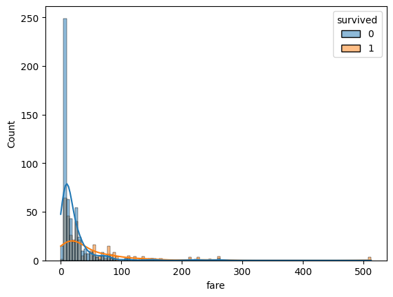
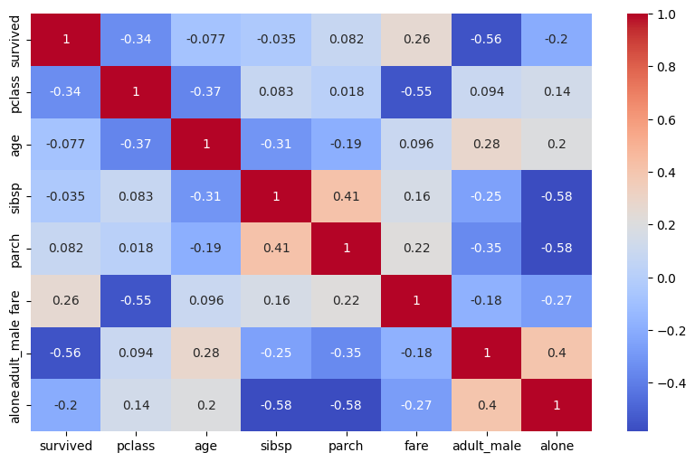
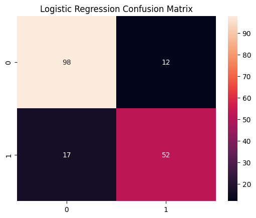
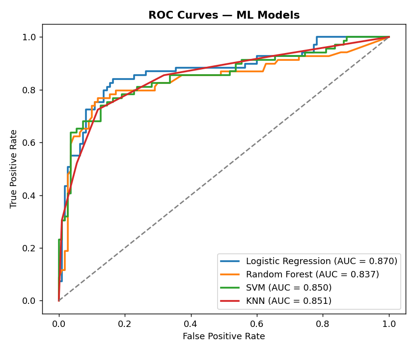
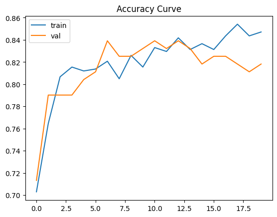
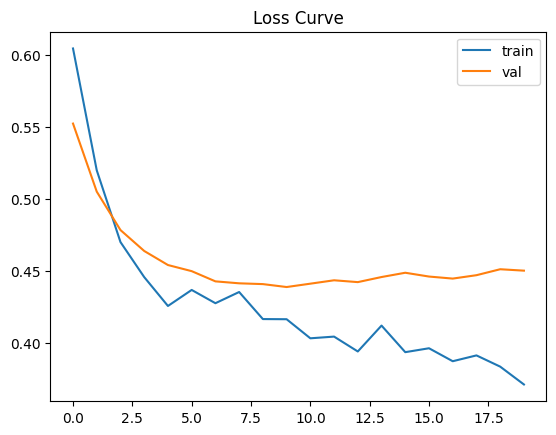
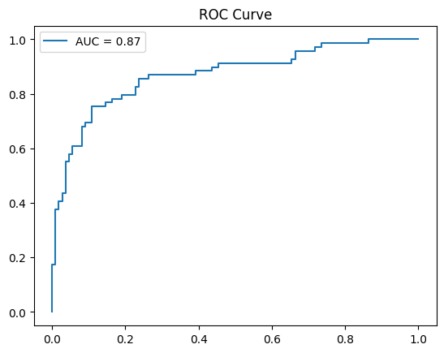

# 🚢 Titanic Survival Predictor — ML vs Deep Learning

Predicting passenger survival on the Titanic by comparing **four classical ML models** (Logistic Regression, Random Forest, SVM, KNN) against a **Dense Neural Network** built with TensorFlow/Keras, and asking when deep learning is actually worth it.


<p align="center">
  
</p>

## 📌 Overview

The dataset contains **891 Titanic passengers** with features such as ticket class, sex, age, fare, family aboard, port of embarkation, and whether the passenger was an adult male or travelling alone. The target is binary: survived (1) or not (0). About **38% of passengers survived**.

## 🔄 Workflow

| Step | Stage | Details |
|------|-------|---------|
| 1 | Data loading | Titanic dataset via `seaborn.load_dataset` |
| 2 | EDA | Survival distribution, age and fare by outcome, sex and adult-male survival rates, correlation heatmap |
| 3 | Cleaning | Dropped redundant or leaky columns (`alive`, `class`, `who`, `embark_town`) and `deck` (77% missing); median imputation for age, mode for embarked |
| 4 | Encoding & scaling | One-hot encoding for `sex` and `embarked`; `StandardScaler` fit on the training set only |
| 5 | Split | Stratified 80/20 train-test split |
| 6 | ML models | Logistic Regression, Random Forest, SVM, KNN |
| 7 | Deep learning | Dense NN (64 → Dropout 0.3 → 32 → 1) with early stopping |
| 8 | Comparison | Accuracy, precision, recall, F1 and ROC-AUC across all five models |

## 🔍 Exploratory Analysis

<table>
  <tr>
    <td></td>
    <td></td>
  </tr>
  <tr>
    <td align="center"><b>Women and children survived at far higher rates</b></td>
    <td align="center"><b>Age distribution by survival</b></td>
  </tr>
  <tr>
    <td></td>
    <td></td>
  </tr>
  <tr>
    <td align="center"><b>Higher fares linked to better survival</b></td>
    <td align="center"><b>Feature correlations</b></td>
  </tr>
</table>

**Key insights**
- Most passengers did not survive (549 vs 342).
- **Sex was the strongest factor:** women survived at a much higher rate than men.
- **Adult males had the lowest survival rate,** well below women and children, consistent with "women and children first".
- Higher fares (a proxy for wealth and ticket class) are associated with better survival odds.

## 📊 Results

Evaluated on a held-out test set of 179 passengers. Precision, recall and F1 are macro-averaged.

| Model | Train Acc | Test Acc | Precision | Recall | F1 | ROC-AUC |
|-------|-----------|----------|-----------|--------|-----|---------|
| **Logistic Regression** | 0.823 | **0.838** | 0.83 | **0.82** | **0.83** | **0.870** |
| Random Forest | 0.982 | 0.838 | 0.83 | 0.82 | 0.83 | 0.837 |
| SVM | 0.848 | 0.821 | 0.83 | 0.79 | 0.80 | 0.850 |
| KNN (k=5) | 0.855 | 0.821 | 0.81 | 0.80 | 0.81 | 0.851 |
| Dense Neural Network | — | 0.821 | 0.82 | 0.80 | 0.80 | 0.87 |

<p align="center">
  
  
</p>

### Neural network training

<p align="center">
  
  
  
</p>

Early stopping (patience 10) halted training at epoch 20 and restored the best weights.

## 🧠 Analysis

**Logistic Regression is the best model overall.** It ties for the highest test accuracy (0.838), has the best ROC-AUC (0.870, level with the neural network) and the best recall on survivors. Its train and test accuracy are close, so it generalizes well.

**Random Forest overfits heavily.** It reaches 98% training accuracy but only 84% on test data, with the lowest ROC-AUC of all models.

**The neural network did not outperform classical ML.** With only ~900 rows, a dense network has little room to learn anything a linear model can't. It matches Logistic Regression's AUC while being slower, harder to interpret, and more prone to overfitting. Deep learning becomes worthwhile with much larger datasets or complex, unstructured inputs.

**Recall matters in high-stakes settings.** If this were a life-or-death prediction, missing a true positive would be costlier than a false alarm, so recall should be prioritized over precision.

## 🚀 Getting Started

```bash
git clone https://github.com/MMujtabaX/Titanic_Survival_Predictor.git
cd Titanic_Survival_Predictor
python -m venv venv
venv\Scripts\activate          # Windows
# source venv/bin/activate     # macOS/Linux
pip install -r requirements.txt
jupyter notebook main.ipynb
```

The dataset loads automatically through Seaborn, so no download is needed.

## 📁 Project Structure

```
├── assets/            # Plots used in this README
├── main.ipynb         # Full analysis: EDA, ML models, neural network, comparison
├── requirements.txt
└── README.md
```

## ⚠️ Limitations & Future Work

- **Feature engineering:** passenger titles (Mr, Mrs, Master), family size and cabin deck letters are known to improve Titanic models.
- **Cross-validation:** with only 179 test samples, a single split is noisy. Stratified k-fold CV would give more reliable comparisons.
- **Hyperparameter tuning:** a tuned Random Forest (limited depth, minimum leaf size) would reduce overfitting; gradient boosting is also worth trying.
- **Neural network regularization:** L2 penalties, batch normalization, or a smaller network may suit this small dataset better.

## 📚 Dataset

Titanic passenger dataset, loaded from the Seaborn library (originally from Kaggle's *Titanic: Machine Learning from Disaster*).

## 👤 Author

**Muhammad Mujtaba Khan Suri** — CS @ UBIT, University of Karachi
[GitHub](https://github.com/MMujtabaX)
